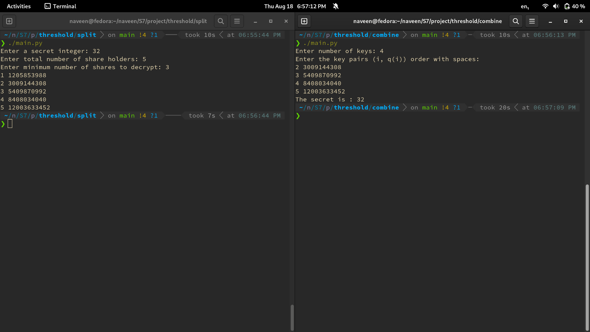
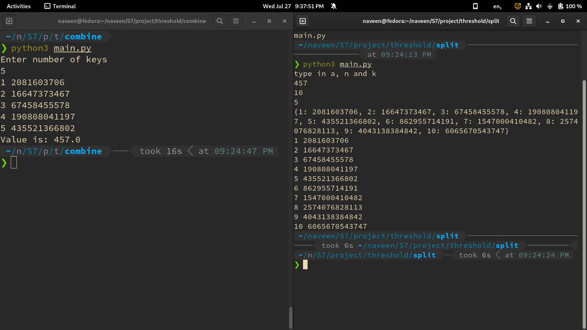

# Threshold Cryptography

 - [x] N shares out of which k should be there
 - [x] N shares out of which all n should be there
 - [ ] N shares out of which m `(m < n)` specific ones to be there
 - [ ] N shares out of which m `(m < n)` randomly selected parts to be mandatorily there

## V3

 - n people are there
 - m special people
 - k total people to decrypt
 - m special people should mandatorily be there
 - `m <= k`
 - if m = k: public will have keys but no use

---

 - In this implementation, we will give the special people a larger number of keys such that the secret is decrypted only once the required number of people (including all the special people) provide their keys.
```
n = number of people
m = number of special people
k = number of people needed to decrypt
m <= k

For decryption, we require m special people and at least ( k - m ) normal people.
(n - m) - (k - m) normal people should not be able to replace even one special person.
Let 1 key be given to each normal person.
Let x be the number of keys given to each special person.

x >= (n - m) - (k - m) + 1
x >= n - k + 1

So let us take the minima x = n - k + 1 to be the number of keys given to each special person.
Let K be the total number of keys required to decrypt the secret.
K = (n - k + 1) * m + (k - m) 
 	 [special]        [normal]

Let N be the total number of keys.
N = (n - k + 1) * m + (n - m)

V1 can be used with N and K to get the required scheme.
```

## V2

 - Code refactoring for `split/main.py`
 - Lagrange interpolation using `scipy` library in `combine/main.py`


## V1



